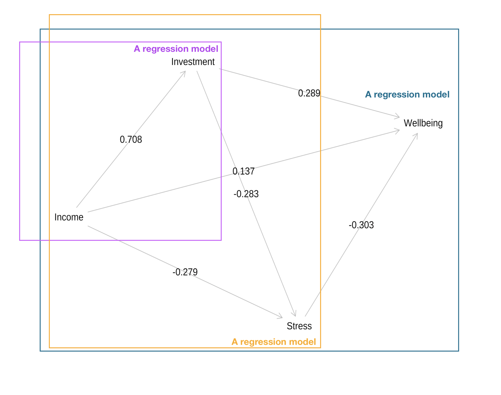
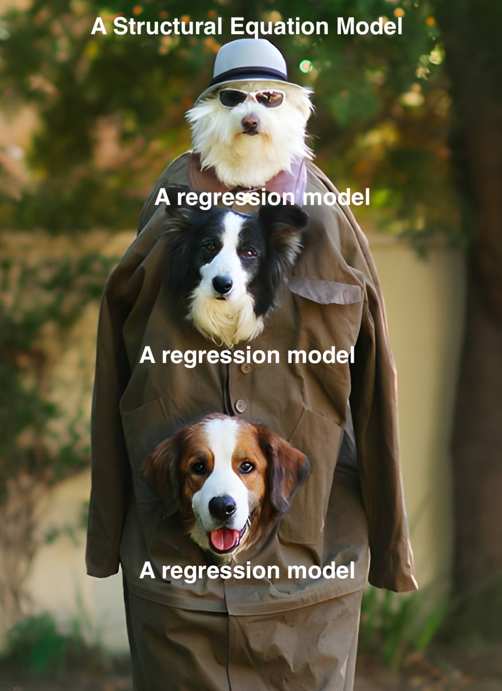
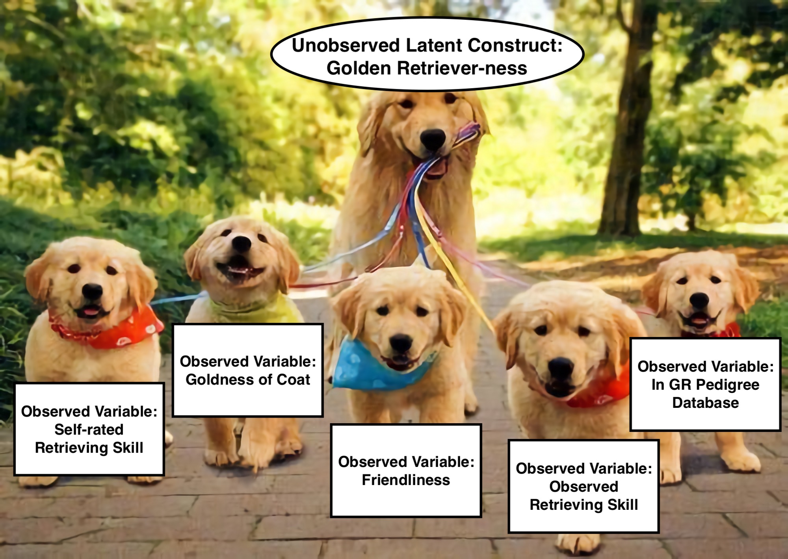
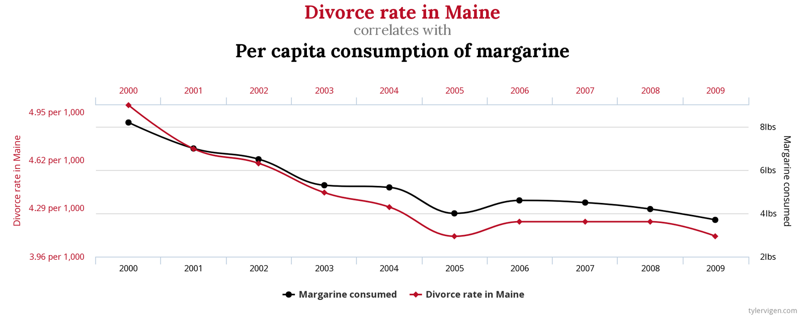
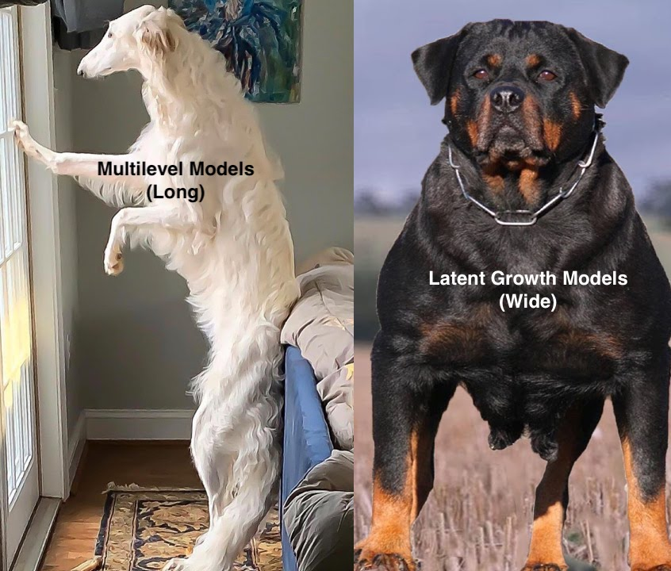

class: middle, title
background-size: contain

<br><br><br><br>

## Structural Equation Modelling: A taster

**Dr. Calum Webb**<br>
Deputy Director of Advanced Data Analytics, Sheffield Methods Institute, the University of Sheffield<br>
[c.j.webb@sheffield.ac.uk](mailto:c.j.webb@sheffield.ac.uk)

```{r setup, include=FALSE}
options(htmltools.dir.version = FALSE)
library(patchwork)
library(dagitty)
library(lavaan)

# These packages are required for creating the slides
# Many will need to be installed from Github
library(icons)
library(tidyverse)
library(xaringan)
library(xaringanExtra)
library(xaringanthemer)

# Defaults for code
knitr::opts_chunk$set(
  fig.width=9, fig.height=3.5, fig.retina=3,
  out.width = "100%",
  cache = FALSE,
  echo = TRUE,
  message = FALSE, 
  warning = FALSE,
  fig.show = TRUE,
  hiline = TRUE
)

# set global theme for ggplot to make background #F8F8F8F8 (off white),
# but otherwise keep all ggplot themes default (better for teaching)
theme_set(
  theme(plot.background = element_rect(fill = "#F8F8F8", colour = "#F8F8F8"), 
        panel.background = element_rect(fill = "#F8F8F8", colour = "#F8F8F8"),
        legend.background = element_rect(fill = "#F8F8F8", colour = "#F8F8F8")
        )
  )

knitr::opts_chunk$set(
  fig.width=9, fig.height=3.5, fig.retina=3,
  out.width = "100%",
  cache = FALSE,
  echo = TRUE,
  message = FALSE, 
  warning = FALSE,
  fig.show = TRUE,
  hiline = TRUE
)
```

```{r xaringan-tile-view, echo=FALSE}
xaringanExtra::use_tile_view()
```

```{r xaringan-logo, echo=FALSE}
xaringanExtra::use_logo(
  image_url = "header/smi-logo-white.png",
  exclude_class = c("inverse", "hide_logo"), 
  width = "180px", position = css_position(top = "1em", right = "2em")
)
```

```{r xaringan-themer, include=FALSE, warning=FALSE}

xaringanExtra::use_tachyons()

# Set some global objects containing the colours
# of the university's branding
primary_color <- "#131E29"
secondary_color <- "#440099"
tuos_blue <- "#9ADBE8"
white = "#F8F8F8"
tuos_yellow <- "#FCF281"
tuos_purple <- "#440099"
tuos_red <- "#E7004C"
tuos_midnight <- "#131E29"

# The bulk of the styling is handled by xaringanthemer
style_duo_accent(
  primary_color = "#131E29",
  secondary_color = "#440099",
  colors = c(tuos_purple = "#440099", 
             grey = "#131E2960", 
             tuos_blue ="#9ADBE8",
             tuos_mint = "#00CE7C"),
  header_font_google = xaringanthemer::google_font("Source Serif Pro", "600", "600i"),
  text_font_google   = xaringanthemer::google_font("Source Sans Pro", "300", "300i", "600", "600i"),
  code_font_google   = xaringanthemer::google_font("Lucida Console"),
  header_h1_font_size = "2rem",
  header_h2_font_size = "1.5rem", 
  header_h3_font_size = "1.25rem", 
  text_font_size = "0.9rem",
  code_font_size = "0.65rem", 
  code_inline_font_size = "0.85rem",
  inverse_text_color = "#9ADBE8", 
  background_color = "#F8F8F8", 
  text_color = "#131E29", 
  link_color = "#005A8F", 
  inverse_link_color = "#F8F8F8",
  text_slide_number_color = "#44009970",
  table_row_even_background_color = "transparent", 
  table_border_color = "#44009970",
  text_bold_font_weight = 600
)
```

```{r xaringan-panelset, echo=FALSE}
xaringanExtra::use_panelset()
```

```{r xaringanExtra, echo = FALSE}
# Adds white progress bar to top
xaringanExtra::use_progress_bar(color = "#F8F8F8", location = "top")
```

```{r xaringan-extra-styles, echo = FALSE}
xaringanExtra::use_extra_styles(
  hover_code_line = TRUE,         #<<
  mute_unhighlighted_code = TRUE  #<<
)
```

```{r share-again, echo=FALSE}
# Add sharing links and other embedding tools
xaringanExtra::use_share_again()
```

```{r xaringanExtra-search, echo=FALSE}
# Add magnifying glass search function to bottom left for quick
# searching of slides
xaringanExtra::use_search(show_icon = TRUE, auto_search = FALSE)
```


```{r metathis, echo=FALSE}
# Add metadata

# library(metathis)
# meta() %>%
#   meta_name("github-repo" = "cjrwebb/cjrwebb.github.io/tree/master/pres/smi") %>% 
#   meta_social(
#     title = "In Defence of Ordinary Help: The declining effectiveness of preventative children's services in England",
#     description = paste(
#       "On average, an additional £40 spent per child on preventative services in a given year was associated with decreases of nearly 5 children in need per 10,000, but this effectiveness has been declining over the decade."
#     ),
#     url = "https://cjrwebb.github.io/pres/smi/smi-research",
#     image = "https://cjrwebb.github.io/pres/smi/idoh-card.png",
#     image_alt = paste(
#       "Title slide of In Defence of Ordinary Help"
#     ),
#     og_type = "website",
#     og_author = "Calum Webb",
#     twitter_card_type = "summary_large_image",
#     twitter_creator = "@cjrwebb",
#     twitter_site = "@cjrwebb"
#   )

drawdag <- function (x, col_arrow = "black", col_segment = "black", col_labels = "black", 
    cex = 1, lwd = 1.5, goodarrow = TRUE, xlim, ylim, shapes, 
    col_shapes, radius = 3.5, add = FALSE, xkcd = FALSE, latent_mark = "c", 
    ...) 
{
    require(dagitty)
    if (class(x) == "list") {
        n <- length(x)
        y <- make.grid(n)
        par(mfrow = y)
        for (i in 1:n) drawdag(x[[i]], ...)
        return(invisible(NULL))
    }
    x <- as.dagitty(x)
    dagitty:::.supportsTypes(x, c("dag", "mag", "pdag"))
    coords <- coordinates(x)
    if (any(!is.finite(coords$x) | !is.finite(coords$y))) {
        coords <- coordinates(graphLayout(x))
    }
    labels <- names(coords$x)
    if (add == FALSE) {
        par(mar = rep(0, 4))
        plot.new()
        par(new = TRUE)
    }
    wx <- sapply(paste0("mm", labels), function(s) strwidth(s, 
        units = "inches"))
    wy <- sapply(paste0("\n", labels), function(s) strheight(s, 
        units = "inches"))
    ppi.x <- dev.size("in")[1]/(max(coords$x) - min(coords$x))
    ppi.y <- dev.size("in")[2]/(max(coords$y) - min(coords$y))
    wx <- wx/ppi.x
    wy <- wy/ppi.y
    if (missing(xlim)) 
        xlim <- c(min(coords$x - wx/2), max(coords$x + wx/2))
    if (missing(ylim)) 
        ylim <- c(-max(coords$y + wy/2), -min(coords$y - wy/2))
    if (add == FALSE) 
        plot(NA, xlim = xlim, ylim = ylim, xlab = "", ylab = "", 
            bty = "n", xaxt = "n", yaxt = "n")
    unobs_vars <- latents(x)
    if (length(unobs_vars) > 0 & !is.null(latent_mark)) {
        if (missing(shapes)) 
            shapes <- list()
        for (uv in unobs_vars) {
            if (is.null(shapes[[uv]])) 
                shapes[[uv]] <- latent_mark
        }
    }
    xlabels <- lapply(labels, function(l) {
        lr <- l
        xx <- strsplit(l, "_")[[1]]
        if (length(xx) > 1) {
            lr <- bquote(.(xx[1])[.(xx[2])])
        }
        return(lr)
    })
    xxbuffer <- strwidth("xx")
    yybuffer <- strheight("\n")
    wx <- sapply(xlabels, function(s) strwidth(s) + xxbuffer)
    wy <- sapply(xlabels, function(s) max(strheight(s), yybuffer))
    names(wx) <- labels
    names(wy) <- labels
    if (length(unobs_vars) > 0 & !is.null(latent_mark)) {
        wx[unobs_vars] <- xxbuffer * 2.1
        wy[unobs_vars] <- yybuffer * 1.1
    }
    asp <- par("pin")[1]/diff(par("usr")[1:2])/(par("pin")[2]/diff(par("usr")[3:4]))
    ex <- dagitty::edges(x)
    ax1 <- rep(0, nrow(ex))
    ax2 <- rep(0, nrow(ex))
    ay1 <- rep(0, nrow(ex))
    ay2 <- rep(0, nrow(ex))
    axc <- rep(0, nrow(ex))
    ayc <- rep(0, nrow(ex))
    acode <- rep(2, nrow(ex))
    has.control.point <- rep(FALSE, nrow(ex))
    for (i in seq_len(nrow(ex))) {
        if (ex[i, 3] == "<->") {
            acode[i] <- 3
            has.control.point[i] <- TRUE
        }
        if (ex[i, 3] == "--") {
            acode[i] <- 0
        }
        l1 <- as.character(ex[i, 1])
        l2 <- as.character(ex[i, 2])
        x1 <- coords$x[l1]
        y1 <- coords$y[l1]
        x2 <- coords$x[l2]
        y2 <- coords$y[l2]
        if (is.na(ex[i, 4]) || is.na(ex[i, 5])) {
            cp <- dagitty:::.autoControlPoint(x1, y1, x2, y2, 
                asp, 0.2 * as.integer(acode[i] == 3))
        }
        else {
            cp <- list(x = ex[i, 4], y = ex[i, 5])
            has.control.point[i] <- TRUE
        }
        bi1 <- dagitty:::.lineSegBoxIntersect(x1 - wx[l1]/2, 
            y1 - wy[l1]/2, x1 + wx[l1]/2, y1 + wy[l1]/2, x1, 
            y1, cp$x, cp$y)
        bi2 <- dagitty:::.lineSegBoxIntersect(x2 - wx[l2]/2, 
            y2 - wy[l2]/2, x2 + wx[l2]/2, y2 + wy[l2]/2, cp$x, 
            cp$y, x2, y2)
        if (length(bi1) == 2) {
            x1 <- bi1$x
            y1 <- bi1$y
        }
        if (length(bi2) == 2) {
            x2 <- bi2$x
            y2 <- bi2$y
        }
        ax1[i] <- x1
        ax2[i] <- x2
        ay1[i] <- y1
        ay2[i] <- y2
        axc[i] <- cp$x
        ayc[i] <- cp$y
    }
    directed <- acode == 2 & !has.control.point
    undirected <- acode == 0 & !has.control.point
    arr.width <- 0.15
    arr.type <- "curved"
    arr.adj <- 1
    if (xkcd == TRUE) {
        for (ii in 1:length(ax1[directed])) {
            lines_xkcd(c(ax1[directed][ii], ax2[directed][ii]), 
                c(-ay1[directed][ii], -ay2[directed][ii]), col = col_segment, 
                lwd = lwd * 2, lwdbg = lwd * 4, seg = 10)
        }
        arr.width <- arr.width * lwd
        arr.type <- "triangle"
        arr.adj <- 0.5
        goodarrow <- TRUE
    }
    if (goodarrow == TRUE) {
        shape::Arrows(ax1[directed], -ay1[directed], ax2[directed], 
            -ay2[directed], arr.length = 0.2, arr.width = arr.width, 
            col = col_arrow, lwd = lwd, arr.adj = arr.adj, arr.type = arr.type)
    }
    else arrows(ax1[directed], -ay1[directed], ax2[directed], 
        -ay2[directed], length = 0.1, col = col_arrow, lwd = lwd)
    segments(ax1[undirected], -ay1[undirected], ax2[undirected], 
        -ay2[undirected], col = col_segment, lwd = lwd)
    for (i in which(has.control.point)) {
        dag_arc(ax1[i], -ay1[i], ax2[i], -ay2[i], axc[i], -ayc[i], 
            col = c(col_arrow, col_segment)[1 + (acode[i] == 
                0)], code = acode[i], length = 0.1, lwd = lwd + 
                (acode[i] == 0), goodarrow = goodarrow)
    }
    if (!missing(shapes)) {
        if (length(shapes) > 0) {
            for (i in 1:length(shapes)) {
                the_label <- names(shapes)[i]
                j <- which(labels == the_label)
                if (missing(col_shapes)) 
                  col_shapes <- col_labels[min(j, length(col_labels))]
                if (length(j) > 0) {
                  cpch <- 1
                  if (shapes[[i]] == "fc") 
                    cpch <- 16
                  if (shapes[[i]] %in% c("c", "fc")) 
                    points(coords$x[the_label], -coords$y[the_label], 
                      cex = radius, lwd = lwd, col = col_shapes, 
                      pch = cpch)
                }
            }
        }
    }
    for (i in 1:length(xlabels)) {
        k <- col_labels
        text(coords$x[i], -coords$y[labels][i], xlabels[[i]], 
            cex = cex, col = k)
    }
    arrtab <- data.frame(ax1, ay1, ax2, ay2, directed)
    return(invisible(arrtab))
}


```

---

class: middle

# Pre-requisites

If I want to learn Structural Equation Modelling I should already have...

* A very good understanding of **multiple linear regression**
* Good familiarity with terms like **variance, covariance, correlation** 
* It can help to have some familiarity with **data tidying** (i.e. in R), especially for converting between **long and wide data formats**
* Formal understanding of **causal diagrams**/Directed Acyclic Graphs can be helpful


---

class: middle


## Is it more effective to increase family income and spending on their children to improve child wellbeing, or is it more effective to reduce family stress?

**Variables**

* `income` = Family income (in £1000s)
* `investment` = Amount spent on child (in £1000s)
* `stress_q1` = Approximately how many times over the last year have you gotten into a disagreement with a co-parent or family member about the parenting of your child(ren)? (10 point scale, centered at 5)
* `scws` = Child wellbeing (Stirling Child Wellbeing Scale, range 12-60, higher = better wellbeing)


---

class: middle


.pull-left[

<br><br>

## Is it more effective to increase family income and spending on their children to improve child wellbeing, or is it more effective to reduce family stress?

]

.pull-right[

```{r, include = FALSE}

dat <- read_csv("../data/example-data-sem.csv")

```

```{r, echo = FALSE, results='asis'}

mod1 <- lm(data = dat, formula = scale(scws) ~ scale(income) + scale(investment) + scale(stress_q1))

stargazer::stargazer(mod1, type = "html", single.row = TRUE)

```

]


---

class: middle

.pull-left-big[
<br>
.center[

.bg-white.b--purple.ba.bw2.br3.shadow-5.ph4[

```{r, echo = FALSE, fig.height = 4.5, fig.width = 7, out.width = 700, out.height=450}

dag <- dagitty(
  "dag{
  
  Income -> Investment -> Stress -> Wellbeing
  Income -> Stress
  Income -> Wellbeing
  Investment -> Wellbeing
  
  }"
)

dag_coords <-    list(x = c(Income = 1, Investment = 1.7, Stress = 2.3, Wellbeing = 3),
                         y = c(Income = 0.3, Investment = -0.7, Stress = 1, Wellbeing = -0.3))

coordinates(dag) <- dag_coords

plot(dag, cex = 1.2)


```

]

]
]

.pull-right-small[

<br><br><br><br><br><br><br><br>

* Can't have investment without income...
* Income and investment probably both impact family stress, which then impacts wellbeing...

]

---

class: middle, center


<br>
.center[

.bg-white.b--purple.ba.bw2.br3.shadow-5.ph4[

```{r, echo = FALSE, fig.height = 4.5, fig.width = 7, out.width = 700, out.height=450}

library(lavaan)

{sem_mod <- "

Investment ~ Income
Stress ~ Investment + Income
Wellbeing ~ Investment + Income + Stress

"}

dat <- dat %>% mutate(
  Investment = scale(investment),
  Income = scale(income),
  Stress = scale(stress_q1),
  Wellbeing = scale(scws)
)

sem_out <- sem(sem_mod, data = dat)

dag_coef <- lavaanToGraph(sem_out)

coordinates(dag_coef) <- dag_coords

plot(dag_coef, cex = 1.2, show.coefficients = TRUE)

```
]

]

---

### Structural Equation Modelling

.pull-left[

`Wellbeing ~ Income + Investment + Stress`

`Stress ~ Income + Investment`

`Investment ~ Income`

.bg-white.b--purple.ba.bw2.br3.shadow-5.ph4[

```{r, echo = FALSE}



```

]

]

.pull-right[

.center[

```{r, echo = FALSE, out.width="70%"}



```

]

]

---

<br><br>

### Path Analysis

.pull-left-big[
.center[
.bg-white.b--purple.ba.bw2.br3.shadow-5.ph4[

```{r, echo = FALSE, fig.height = 4.5, fig.width = 7, out.width = 700, out.height=450}


plot(dag_coef, cex = 1.2, show.coefficients = TRUE)

```

]]]

```{r, include = FALSE}

{sem_mod <- "

Investment ~ a1*Income
Stress ~ b1*Investment + a2*Income
Wellbeing ~ c1*Investment + d1*Income + c2*Stress

wb_inv_inc := a1*c1
wb_str_inv_inc := c2*b1*a1
wb_str_inc := a2*c2
tot_indir_inc := wb_inv_inc + wb_str_inv_inc + wb_str_inc
total_inc := tot_indir_inc + d1

wb_str_inv := b1*c2
total_inv := wb_str_inv + c1

"}


sem_out <- sem(sem_mod, data = dat)
summary(sem_out)

```


.pull-right-small[

**Direct Effects**

* Income: **0.137**
* Investment: **0.289**
* Stress: **-0.303**

**Indirect Effects**

Income through...
* Stress: -0.279 x -0.303 = **0.085**
* Investment: 0.708 x 0.289 = **0.204**
* Investment & Stress: 0.708 x -0.283 x -0.303 = **0.061**

**Total Income Effect**

0.137 + 0.085 + 0.204 + 0.061 = **0.487**


]


---

class: middle

<br>

## But what is family stress? And is this question the best measure of it?


---

class: middle

.pull-left-small[

<br>

### Latent Variables (Factor Analysis)

- We can't just ask: "How much family stress do you experience on a scale of 1-10?" and expect a good measure.
- We **operationalise** the concept into distinct questions, e.g.:

  * How frequently do you have disagreements about parenting?
  * Do you sometimes regret having children?
  * How often do you feel like you go to bed angry at your partner?
  
- All of these questions capture *something* about family stress, but none of them capture it exactly.

]

.pull-right-big[

.center[
<br>

.bg-white.b--purple.ba.bw2.br3.shadow-5.ph4[

```{r, echo = FALSE, out.width="90%"}



```

]
]

]

---

class: middle

### Latent Variables (Factor Analysis)

.pull-left[

<br>

**We shouldn't**

* Chuck all of these similar questions into a single regression model (because of multicollinearity)

* Sum up all of the responses uncritically:
  * What if they are all on different scales and need to be weighted differently?
  * What if some of the questions are worse measures of the concept than others?
  * What if some questions are more salient for some groups of people than others?
  
**We can**

* Use factor analysis/construct a latent variable to try and capture the 'underlying' concept.

]


.pull-right[

.bg-white.b--purple.ba.bw2.br3.shadow-5.ph4[

```{r, echo=FALSE, warning = FALSE, message = FALSE, fig.width=4.5, fig.height=4.5, out.height=450, out.width=450, dpi=400}

library(ggVennDiagram)

# List of items
x <- list(Q1 = 1:6, Q2 = 2:8, Q3 = 4:10, Q4 = 7:13, Q5 = 9:15)

venn <- Venn(x)
venn_dat <- process_data(venn)

ggplot() +
  geom_polygon(aes(X, Y, group = id), fill = "transparent", data = venn_regionedge(venn_dat)) +
   geom_path(aes(X, Y, group = id), 
          colour = tuos_purple,   
          data = venn_setedge(venn_dat), 
          show.legend = FALSE) +
  geom_text(aes(X, Y, label = name), colour = tuos_purple,
               data = venn_setlabel(venn_dat)) +
  coord_equal() +
  theme_void() 


```

]
]


---

class: middle

.pull-left[

### Latent Variables (Factor Analysis)

Factor analysis constructs a latent variable that simultaneously predicts multiple indicator (or manifest) variables.

Its scale is arbitrary but is commonly fixed to either a) a marker variable or b) a standardised distribution (mean = 0, sd = 1).


]

```{r, include = FALSE}

{stress_cfa <- "

stress =~ NA*stress_q1 + stress_q2 + stress_q3 + stress_q4 + stress_q5
stress ~~ 1*stress

"}

stress_cfa_out <- cfa(stress_cfa, data = dat)
stress_lv <- lavPredict(stress_cfa_out)


library(lavaanPlot)


```

.pull-right[

.bg-white.b--purple.ba.bw2.br3.shadow-5.ph4[
```{r, echo = FALSE, out.width=400, out.height=200, fig.height=2, fig.width=4}

lavaanPlot(model = stress_cfa_out, coefs = TRUE, stand = TRUE)

```
]

]


---

### Latent Variables (Factor Analysis)

```{r, echo = FALSE, out.width = 1200, out.height=500, fig.width=12, fig.height=5}


GGally::ggpairs(tibble(stress_lv = as.numeric(stress_lv), stress_q1 = dat$stress_q1, stress_q2 = dat$stress_q2, stress_q3 = dat$stress_q3, stress_q4 = dat$stress_q4, stress_q5 = dat$stress_q5))


```


---

### SEM with Latent Variables


.bg-white.b--purple.ba.bw2.br3.shadow-5.ph4[
.center[

```{r, echo = FALSE, out.height=500, out.width=700, fig.height=5, fig.width=7}

dat$Stress <- NULL

{sem_mod <- "

Stress =~ NA*stress_q1 + stress_q2 + stress_q3 + stress_q4 + stress_q5
Stress ~~ resvar*Stress

resvar == 1 - 0.335
  
Investment ~ a1*Income
Stress ~ b1*Investment + a2*Income
Wellbeing ~ c1*Investment + d1*Income + c2*Stress

wb_inv_inc := a1*c1
wb_str_inv_inc := c2*b1*a1
wb_str_inc := a2*c2
tot_indir_inc := wb_inv_inc + wb_str_inv_inc + wb_str_inc
total_inc := tot_indir_inc + d1

wb_str_inv := b1*c2
total_inv := wb_str_inv + c1

"}


sem_out <- sem(sem_mod, data = dat)
#summary(sem_out, standardized = TRUE, rsquare = TRUE)

sem_with_lv <- lavaanToGraph(sem_out, digits = 2)

{sem_with_lv <- '

dag {
Income
Investment
Stress [latent]
Wellbeing
stress_q1
stress_q2
stress_q3
stress_q4
stress_q5
Income -> Investment [beta="0.708"]
Income -> Stress [beta="-0.322"]
Income -> Wellbeing [beta="0.105"]
Investment -> Stress [beta="-0.304"]
Investment -> Wellbeing [beta="0.265"]
Stress -> Wellbeing [beta="-0.361"]
Stress -> stress_q1 [beta="0.90"]
Stress -> stress_q2 [beta="0.90"]
Stress -> stress_q3 [beta="0.88"]
Stress -> stress_q4 [beta="0.92"]
Stress -> stress_q5 [beta="0.89"]
}'}


sem_with_lv <- dagitty(sem_with_lv)

coords_complex <- list(x = c(Income = 1, Investment = 1.7, Stress = 2.3, Wellbeing = 3,
                             stress_q1 = 1.7, stress_q2 = 2, stress_q3 = 2.3, 
                             stress_q4 = 2.6, stress_q5 = 2.9),
                       y = c(Income = 0.3, Investment = -0.7, Stress = 1, Wellbeing = -0.3,
                             stress_q1 = 1.5, stress_q2 = 1.5, stress_q3 = 1.5, 
                             stress_q4 = 1.5, stress_q5 = 1.5)
     ) 

coordinates(sem_with_lv) <- coords_complex
latents(sem_with_lv) <- "Stress"

circle_points <- function(points_to_circle, g, cex = 4) {
    #few regexs to extract the points and the positions from "g"
    #can surely be optimized, made nicer and more robust but it works for now
    fsplit <- strsplit(g[1], "\\]")[[1]]
    fsplit <- fsplit[-length(fsplit)]
    fsplit <- substr(fsplit, 1, nchar(fsplit)-1)
    fsplit[1] <- substr(fsplit[1], 6, nchar(fsplit))
    vars <- sapply(regmatches(fsplit,
                              regexec("\\\n(.*?)\\s*\\[", fsplit)), "[", 2)
    pos <- sub(".*pos=\\\"", "", fsplit)
    
    #build dataframe with extracted information
    res_df <- data.frame(vars = vars, 
                         posx = sapply(strsplit(pos, ","), "[",1), 
                         posy = sapply(strsplit(pos, ","), "[",2))
    df_to_circle <- res_df[res_df$vars %in% points_to_circle,]
    
    #y-position seems to be inverted and has to be multiplied by -1
    points(c(as.numeric(df_to_circle$posx)), 
           c(as.numeric(df_to_circle$posy) * -1), 
           cex = cex)
}


plot(sem_with_lv, show.coefficients = TRUE)
circle_points("Stress", sem_with_lv, cex = 8)

```

]
]

---

class: middle

### Latent Growth Modelling

.bg-white.b--purple.ba.bw2.br3.shadow-5.ph4[

```{r, echo = FALSE}



```

]

---

class: middle

.pull-left-small[

<br>
### Latent Growth Modelling
Constraints on latent variables can also be used in clever ways to capture change over time.


]

.pull-right-big[

.center[

<br><br><br>
.bg-white.b--purple.ba.bw2.br3.shadow-5.ph4[
```{r, echo = FALSE, out.width="100%"}

long_dat <- read_csv("../data/margarines_divorce.csv")

{divorce_margarine_pp_cr_mod <- "

  i_div =~ 1*divorce_1 + 1*divorce_2 + 1*divorce_3 + 1*divorce_4 + 
           1*divorce_5 + 1*divorce_6 + 1*divorce_7 + 1*divorce_8 + 
           1*divorce_9 + 1*divorce_10
  s_div =~ 0*divorce_1 + 1*divorce_2 + 2*divorce_3 + 3*divorce_4 + 
           4*divorce_5 + 5*divorce_6 + 6*divorce_7 + 7*divorce_8 + 
           8*divorce_9 + 9*divorce_10
  
  i_marg =~ 1*margarine_1 + 1*margarine_2 + 1*margarine_3 + 1*margarine_4 + 
           1*margarine_5 + 1*margarine_6 + 1*margarine_7 + 1*margarine_8 + 
           1*margarine_9 + 1*margarine_10
  s_marg =~ 0*margarine_1 + 1*margarine_2 + 2*margarine_3 + 3*margarine_4 + 
           4*margarine_5 + 5*margarine_6 + 6*margarine_7 + 7*margarine_8 + 
           8*margarine_9 + 9*margarine_10
  
  # Estimate covariance between all latent variables
  i_div ~~ s_div + i_marg + s_marg
  s_div ~~ i_marg + s_marg
  i_marg ~~ s_marg
  
  
  # Fix all of the residual variance for the indicator
  # variables to be the same (maybe too strong an assumption
  # to make, but can be tested)
  divorce_1 ~~ resd*divorce_1
  divorce_2 ~~ resd*divorce_2
  divorce_3 ~~ resd*divorce_3
  divorce_4 ~~ resd*divorce_4
  divorce_5 ~~ resd*divorce_5
  divorce_6 ~~ resd*divorce_6
  divorce_7 ~~ resd*divorce_7
  divorce_8 ~~ resd*divorce_8
  divorce_9 ~~ resd*divorce_9
  divorce_10 ~~ resd*divorce_10
  
  margarine_1 ~~ resd*margarine_1
  margarine_2 ~~ resd*margarine_2
  margarine_3 ~~ resd*margarine_3
  margarine_4 ~~ resd*margarine_4
  margarine_5 ~~ resd*margarine_5
  margarine_6 ~~ resd*margarine_6
  margarine_7 ~~ resd*margarine_7
  margarine_8 ~~ resd*margarine_8
  margarine_9 ~~ resd*margarine_9
  margarine_10 ~~ resd*margarine_10


"}

ppcrmod_out <- growth(divorce_margarine_pp_cr_mod, data = long_dat)

lgm_graph <- lavaanToGraph(ppcrmod_out, digits = 2)

{lgm_graph <- '
dag {
divorce_1
divorce_10
divorce_2
divorce_3
divorce_4
divorce_5
divorce_6
divorce_7
divorce_8
divorce_9
i_div [latent]
i_marg [latent]
margarine_1
margarine_10
margarine_2
margarine_3
margarine_4
margarine_5
margarine_6
margarine_7
margarine_8
margarine_9
s_div [latent]
s_marg [latent]
i_div -> divorce_1 [beta="1"]
i_div -> divorce_10 [beta="1"]
i_div -> divorce_2 [beta="1"]
i_div -> divorce_3 [beta="1"]
i_div -> divorce_4 [beta="1"]
i_div -> divorce_5 [beta="1"]
i_div -> divorce_6 [beta="1"]
i_div -> divorce_7 [beta="1"]
i_div -> divorce_8 [beta="1"]
i_div -> divorce_9 [beta="1"]
i_div <-> i_marg [beta="0.218"]
i_div <-> s_div [beta="0.200"]
i_div <-> s_marg [beta="0.471"]
i_marg -> margarine_1 [beta="1"]
i_marg -> margarine_10 [beta="1"]
i_marg -> margarine_2 [beta="1"]
i_marg -> margarine_3 [beta="1"]
i_marg -> margarine_4 [beta="1"]
i_marg -> margarine_5 [beta="1"]
i_marg -> margarine_6 [beta="1"]
i_marg -> margarine_7 [beta="1"]
i_marg -> margarine_8 [beta="1"]
i_marg -> margarine_9 [beta="1"]
i_marg <-> s_div [beta="0.395"]
i_marg <-> s_marg [beta="0.458"]
s_div -> divorce_1 [beta="0"]
s_div -> divorce_10 [beta="9"]
s_div -> divorce_2 [beta="1"]
s_div -> divorce_3 [beta="2"]
s_div -> divorce_4 [beta="3"]
s_div -> divorce_5 [beta="4"]
s_div -> divorce_6 [beta="5"]
s_div -> divorce_7 [beta="6"]
s_div -> divorce_8 [beta="7"]
s_div -> divorce_9 [beta="8"]
s_div <-> s_marg [beta="0.417"]
s_marg -> margarine_1 [beta="0"]
s_marg -> margarine_10 [beta="9"]
s_marg -> margarine_2 [beta="1"]
s_marg -> margarine_3 [beta="2"]
s_marg -> margarine_4 [beta="3"]
s_marg -> margarine_5 [beta="4"]
s_marg -> margarine_6 [beta="5"]
s_marg -> margarine_7 [beta="6"]
s_marg -> margarine_8 [beta="7"]
s_marg -> margarine_9 [beta="8"]
}'}

lgm_graph <- dagitty(lgm_graph)

lgm_coords <- list(x = c(i_div = 0, s_div = 1, 
                         divorce_1 = 3, divorce_2 = 4, divorce_3 = 5, divorce_4 = 6, divorce_5 = 7, 
                         divorce_6 = 8, divorce_7 = 9, divorce_8 = 10, divorce_9 = 11, 
                         divorce_10 = 12,
                         i_marg = 0.5, s_marg = -1, 
                         margarine_1 = 3, margarine_2 = 4, margarine_3 = 5, 
                         margarine_4 = 6, margarine_5 = 7, 
                         margarine_6 = 8, margarine_7 = 9, margarine_8 = 10, 
                         margarine_9 = 11, margarine_10 = 12),
                   y = c(i_div = 2, s_div = 0.3, 
                         divorce_1 = 1, divorce_2 = 1, divorce_3 = 1, divorce_4 = 1, divorce_5 = 1, 
                         divorce_6 = 1, divorce_7 = 1, divorce_8 = 1, divorce_9 = 1, divorce_10 = 1,
                         i_marg = -2, s_marg = -0.3, 
                         margarine_1 = -1, margarine_2 = -1, margarine_3 = -1, 
                         margarine_4 = -1, margarine_5 = -1, 
                         margarine_6 = -1, margarine_7 = -1, margarine_8 = -1, 
                         margarine_9 = -1, margarine_10 = -1))

coordinates(lgm_graph) <- lgm_coords

plot(lgm_graph, show.coefficients = TRUE, abbreviate.names = TRUE, 
     xlim = c(-2, 13), attrs=list(node=list(fontsize=50)))
circle_points(c("i_marg", "s_marg", "i_div", "s_div"), lgm_graph, cex = 7)

```

]

]

]

---

class: middle

.pull-left-small[

<br>
### Latent Growth Modelling

Constraints on latent variables can also be used in clever ways to capture change over time.

  * The mean linear slope for divorce rates was -0.203 per year
  * The mean linear slope for margarine consumption was -0.215 per year, explaining much of why the two are correlated.
  
**But**, a positive correlation between state-level slopes in divorce rate and state-level slopes in margarine consumption (0.417) suggests that divorce rates were falling faster in states where margarine consumption was falling faster (and vice-versa)


]

.pull-right-big[

.center[

<br><br><br>
.bg-white.b--purple.ba.bw2.br3.shadow-5.ph4[
```{r, echo = FALSE, out.width="100%"}

plot(lgm_graph, show.coefficients = TRUE, abbreviate.names = TRUE, 
     xlim = c(-2, 13), attrs=list(node=list(fontsize=50)))
circle_points(c("i_marg", "s_marg", "i_div", "s_div"), lgm_graph, cex = 7)

```
]
]

]


---

class: middle

.pull-left-small[

<br><br>

### Latent Growth Modelling

The fact that latent growth models use wide rather than long data means that there are a few more nuanced options for examining associations between trends as well as residuals between trends:

* What are the associations between latent traits/individuals: intercepts
* What are the associations between latent trends: slopes
* What are the associations between time varying residuals: indicator variable residuals


]

.pull-right-big[
<br>
.bg-white.b--purple.ba.bw2.br3.shadow-5.ph4[
.center[

```{r, echo = FALSE, out.width="80%"}



```

]
]
]

---

class: middle

.pull-left[

## [Open access taster workbook on SEM, CFA, and LGM in R using the `lavaan` package](https://github.com/cjrwebb/aqm-taster-sem)

Link: https://github.com/cjrwebb/aqm-taster-sem 

* Click on Code -> Download as .zip -> Open .Rproj file and `worked-examples.R`

]

.pull-right[

<br>

.bg-white.b--purple.ba.bw2.br3.shadow-5.ph4[
```{r, echo = FALSE, out.width="80%"}


```
]

]


